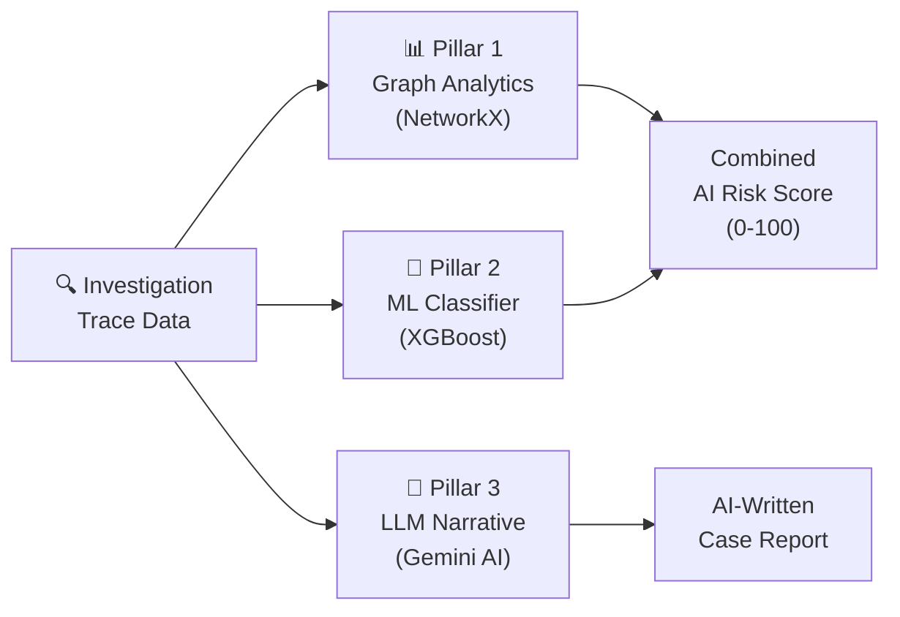
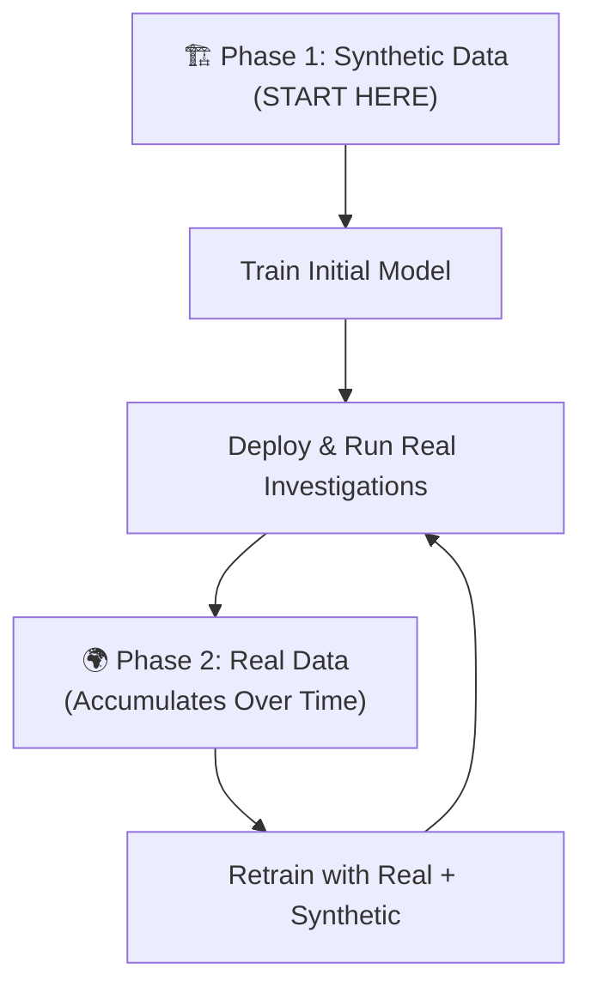

# 🧠 AI/ML in Vajra — Beginner-Friendly Complete Guide

## The Big Picture: What Are We Building?

Right now, your project has a **rule-based** risk scoring system ([rules.py](file:///c:/Users/Mann%20Raval/VSCode/SIH/Vajra/services/risk/rules.py)). Think of it like a checklist:

```
✓ Did funds move through 3+ hops in under 1 hour?  → HIGH RISK (88.5)
✓ Did value drop 20% per hop (peeling chain)?       → HIGH RISK (82.0)
✓ Did funds end at a burner wallet (0 tx history)?   → HIGH RISK (85.0)
✗ None of the above?                                 → LOW RISK  (15.0)
```

**The problem:** This checklist only fires ONE rule (the first match). If a wallet has *two* suspicious patterns that are individually "medium" but together scream "fraud" — the system misses it. It also can't understand the **shape** of how money flows (star pattern vs chain vs hourglass).

**The solution (Phase E3):** We add **3 AI/ML pillars** on top of the existing rules:



---

## Pillar 1: Graph Analytics — "Understanding the Shape"

### What is it? (Simple Explanation)

Imagine money flowing from a scammer to an exchange like water flowing through pipes. The **shape of the pipe network** tells you a lot:

| Shape | What It Looks Like | What It Means |
|-------|-------------------|---------------|
| **Chain** 🔗 | A→B→C→D→E | Simple forwarding, hop by hop |
| **Star** ⭐ | A→B, A→C, A→D, A→E | One person splitting money to many wallets |
| **Hourglass** ⏳ | A→B, A→C, B→D, C→D | Split money, then recombine (suspicious!) |

### What tool do we use?

**NetworkX** — a Python library that builds a mathematical "graph" (nodes = wallets, edges = transfers) and computes metrics like:
- How many wallets are involved?
- What's the fastest hop speed? (scammers move fast!)
- Is there a "hub" wallet controlling everything?
- How interconnected are the wallets?

### Where does it go?

```
services/risk/graph_analytics/network_metrics.py   ← NEW FILE
```

This module takes the trace hops (that the blockchain engine already produces) and feeds them into NetworkX to compute ~18 graph metrics.

---

## Pillar 2: ML Risk Classifier — "The Brain"

### What is it? (Simple Explanation)

Think of it like this:

> **Rules** = a doctor with a fixed checklist ("if temperature > 102°F, you have fever")
> 
> **ML Model** = a doctor who has seen 1,600 patients and learned patterns ("high temperature + headache + body ache together = more likely flu, even if no single symptom is extreme")

The ML model (XGBoost) looks at **28 numbers** that describe a money trail, and outputs a **fraud probability from 0% to 100%** — not just "high/medium/low".

### What is XGBoost?

XGBoost is like a **team of decision trees**. Each tree asks a series of yes/no questions about the 28 features:

```
Is hop_count >= 3?
  ├── YES: Is min_time_between_hops < 3600 sec?
  │     ├── YES: Is terminal_is_exchange = 1?
  │     │     └── FRAUD (95% sure)
  │     └── NO: Probably legit
  └── NO: Is destination_prior_tx_count = 0?
        ├── YES: FRAUD (80% sure)
        └── NO: LOW RISK
```

But instead of 1 tree, XGBoost builds **200 trees** and combines their votes. That's why it's so accurate.

### What is SHAP?

SHAP tells you **WHY** the model made its decision. For each case, it says:

> "The risk score is 87/100 because:
> - `min_time_between_hops_sec = 45` contributed +22 to the score (very fast = suspicious)
> - `is_peeling_chain = 1` contributed +18 (value dropping = money laundering technique)
> - `destination_prior_tx_count = 1200` contributed -15 (old wallet = less suspicious)"

This is **critical for court admissibility** — judges want to know WHY a system flagged something.

### The 28 Features (What the Model Looks At)

Every investigation trace gets converted into 28 numbers:

| # | Feature | What It Means (Plain English) |
|---|---------|-------------------------------|
| 1 | `hop_count` | How many wallet-to-wallet jumps happened |
| 2 | `min_time_between_hops_sec` | The fastest jump (under 60 seconds = automated bot) |
| 3 | `max_time_between_hops_sec` | The slowest jump |
| 4 | `avg_time_between_hops_sec` | Average speed across all jumps |
| 5 | `terminal_is_exchange` | Did the money end at a known exchange? (1=yes, 0=no) |
| 6 | `destination_prior_tx_count` | How old is the final wallet? (0 = brand new "burner") |
| 7 | `is_peeling_chain` | Is each hop getting smaller (peeling off pieces)? |
| 8 | `is_dex_routed` | Did money go through Uniswap/1inch (DEX obfuscation)? |
| 9 | `total_usd_transacted` | Total dollar amount moved |
| 10 | `value_decay_ratio` | How much value was lost from first to last hop |
| 11-18 | Graph metrics | Node count, edge count, centrality, clustering, etc. (from Pillar 1) |
| 19-21 | Topology flags | Is it a chain? Star? Hourglass? |
| 22-23 | Velocity metrics | Fastest/slowest hop times |
| 24-28 | Tree metrics | Number of branches, exchange branches, taint coverage |

### Where does it go?

```
services/risk/ml_models/
  ├── features.py              ← Builds the 28-number vector
  ├── classifier.py            ← Loads the trained model + SHAP
  ├── generate_synthetic.py    ← Creates fake training data
  ├── train.py                 ← Trains the XGBoost model
  └── artifacts/
      ├── vajra_fraud_classifier_v1.pkl  ← The trained model file
      └── feature_names.json             ← List of 28 feature names
```

---

## Pillar 3: LLM Case Narrative — "The Report Writer"

### What is it? (Simple Explanation)

After the investigation is done, an AI (Google Gemini) writes a **3-paragraph professional report** that a police officer can directly paste into their FIR (First Information Report) or court filing.

**Example output:**
> *"On August 15, 2026, an automated blockchain trace was initiated on suspect wallet 0xABC... The on-chain analysis revealed that approximately $12,500 USD worth of USDT was transferred through 4 intermediary wallets within 23 minutes..."*

### LLM Provider Fallback Chain

```
Try Gemini (free API key) → Try Ollama (local) → Use template (no AI needed)
```

### Where does it go?

```
services/risk/llm_narrative/generator.py   ← NEW FILE
```

---

## 📦 Datasets: What, Where, and Which One?

This is probably your biggest question. Let me break it down clearly:

### Strategy: Synthetic First, Real Later



---

### Source 1: Synthetic Data (PRIMARY — Use This First ✅)

> **What:** We **create fake investigation traces** that simulate known fraud and legitimate patterns, then run them through our REAL code pipeline to generate training features.

> **Why synthetic?** Because our 28 features include things like NetworkX graph metrics (clustering coefficient, betweenness centrality) that are **computed by our own code**. If we use an external dataset with different column definitions, the features won't match what our system actually computes at runtime. Training and inference must use the SAME feature calculation code.

**The synthetic data generator creates 1,600 samples:**

| Scenario | Count | Label | What It Simulates |
|----------|-------|-------|-------------------|
| Rapid multi-hop forwarding | 200 | FRAUD | 3-5 hops in under 1 hour |
| Peeling chain | 200 | FRAUD | Value drops 20-50% each hop |
| Burner wallet | 100 | FRAUD | Destination has 0 prior transactions |
| Star fan-out | 150 | FRAUD | 1 wallet sends to 3-5 wallets simultaneously |
| DEX obfuscation | 100 | FRAUD | Routes through Uniswap to hide trail |
| Hourglass | 100 | FRAUD | Split then recombine funds |
| Cluster | 50 | FRAUD | Dense interconnection between wallets |
| **Direct to exchange** | **250** | **LEGIT** | 1-2 hops, slow, normal transfer |
| **Payroll distribution** | **150** | **LEGIT** | Star shape but slow + old wallets |
| **DeFi trading** | **150** | **LEGIT** | Normal Uniswap usage by a real trader |
| **Normal P2P transfer** | **150** | **LEGIT** | Simple person-to-person transfer |

> **Total: 900 fraud + 700 legit = 1,600 training samples**

**You don't need to download anything!** The `generate_synthetic.py` script creates all of this automatically.

---

### Source 2: Elliptic Dataset (OPTIONAL — For Bonus Points 🏆)

> **What:** A real-world dataset from MIT/IBM with 203,769 actual Bitcoin transaction nodes labeled as `illicit` or `licit`.

| Detail | Value |
|--------|-------|
| **Size** | 203,769 transactions, 234,111 edges |
| **Labels** | `illicit` (scam, ransomware, darknet) vs `licit` (exchanges, merchants) |
| **Source** | [Kaggle: Elliptic Data Set](https://www.kaggle.com/datasets/ellipticco/elliptic-data-set) (Free download) |
| **Files** | `elliptic_txs_features.csv`, `elliptic_txs_classes.csv`, `elliptic_txs_edgelist.csv` |

> [!IMPORTANT]
> The Elliptic dataset is on **Bitcoin**, not Ethereum. And its features are wallet-level aggregates (avg time between ALL transactions), not per-trace hop-level features like ours. You **cannot directly use it as training data** for our 28-feature vector. But you can:
> 1. Extract graph subgraphs using the edge list
> 2. Run them through our pipeline to convert to our 28-D features
> 3. Append the converted features to `data/labeled_real.jsonl`

**How to get it:**
1. Go to [kaggle.com/datasets/ellipticco/elliptic-data-set](https://www.kaggle.com/datasets/ellipticco/elliptic-data-set)
2. Download (requires free Kaggle account)
3. Place files in `ml/datasets/`

---

### Source 3: Etherscan Malicious Address Lists (OPTIONAL)

> **What:** Open-source lists of known scam/phishing Ethereum addresses

| Source | URL |
|--------|-----|
| MyEtherWallet list | [github.com/MyEtherWallet/ethereum-lists](https://github.com/MyEtherWallet/ethereum-lists) |
| Forta Network | [github.com/forta-network/malicious-smart-contracts](https://github.com/forta-network/malicious-smart-contracts) |

These aren't direct datasets — they're address blacklists. You could use them to query Etherscan for those wallets' transaction histories, then run those through our feature pipeline to create more real-world labeled samples.

---

### ⚠️ Datasets You Should NOT Use Directly

| Dataset | Why Not |
|---------|---------|
| Kaggle `ethereum-frauddetection-dataset` (vagifa) | Columns are wallet-level aggregates, not per-hop features. Can't map to our 28-D feature vector without data leakage. |
| Any dataset with different column definitions | Our model needs features computed by OUR code (NetworkX metrics, hop velocity, etc.). External features won't match. |

---

## 🔧 Step-by-Step Implementation Order

Here's what we need to build, in order:

```
Step 1: Create constants.py (shared ETH price + DEX router list)
Step 2: Build graph_analytics/network_metrics.py (NetworkX)
Step 3: Build ml_models/features.py (28-D feature vector)
Step 4: Build ml_models/generate_synthetic.py (create training data)
Step 5: Build ml_models/train.py (train XGBoost model)
Step 6: Build ml_models/classifier.py (model loader + SHAP)
Step 7: Build llm_narrative/generator.py (Gemini narrative)
Step 8: Update main.py (add new endpoints)
Step 9: Update apps/api (forward new ML fields to frontend)
Step 10: Update apps/web (display ML score gauge + SHAP chart + narrative)
```

### Where Everything Lives

```
services/risk/                      ← ALL ML/AI code goes here
  ├── constants.py                  ← NEW (Step 1)
  ├── graph_analytics/              ← NEW folder
  │   ├── __init__.py
  │   └── network_metrics.py        ← Step 2
  ├── ml_models/                    ← NEW folder
  │   ├── __init__.py
  │   ├── features.py               ← Step 3
  │   ├── generate_synthetic.py     ← Step 4
  │   ├── train.py                  ← Step 5
  │   ├── classifier.py             ← Step 6
  │   └── artifacts/                ← Model files go here after training
  ├── llm_narrative/                ← NEW folder
  │   ├── __init__.py
  │   └── generator.py              ← Step 7
  ├── data/                         ← NEW folder (training data lands here)
  ├── main.py                       ← MODIFIED (Step 8)
  └── rules.py                      ← MODIFIED (import from constants.py)
```

---

## 🎯 Recommendation: What Should You Do?

> [!TIP]
> **Start with synthetic data only.** It's the fastest path to a working demo and is actually the most technically correct approach for this project. You can add real data later for bonus credibility.

### Priority Order
1. ✅ **Synthetic data** — Generates automatically, guarantees training/inference consistency, 100% within your control
2. 🏆 **Elliptic dataset** — Adds "real-world data" credibility for SIH judges, but requires conversion work
3. 📋 **Etherscan blacklists** — Nice to have, but low priority

---

## Summary: How the ML Actually Improves the Project

| Before (Rules Only) | After (Rules + ML) |
|---------------------|-------------------|
| Score: HIGH / MEDIUM / LOW | Score: 0-100 continuous |
| First matching rule wins | All 28 features considered together |
| "Rapid forwarding detected" | "87/100 risk because: fast hops (+22), peeling chain (+18), known exchange (-15)" |
| No graph shape understanding | Detects star, hourglass, cluster topologies |
| Investigator writes report manually | AI writes 3-paragraph court-ready summary |
| No model explanations | SHAP feature importance for every case |
